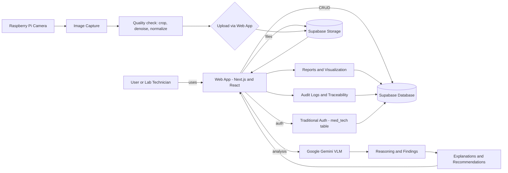
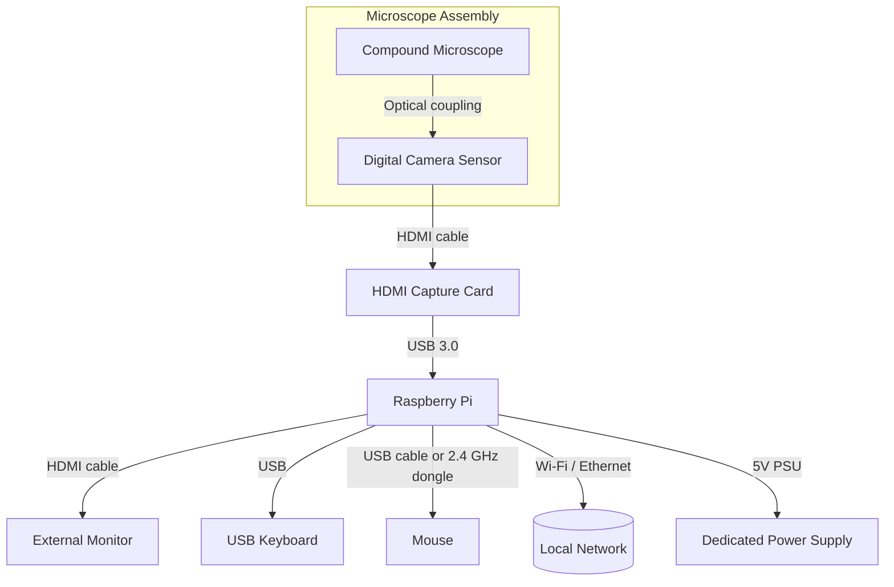

## MicroView AI: Leveraging Large Vision-Language Models in an Augmentative Raspberry Pi–Based System for Urine Microscopy Analysis

This is my undergraduate thesis project for my degree in **Bachelor of Science in Computer Engineering** at **Pamantasan ng Lungsod ng Maynila (PLM)**, where I served as the primary software developer while collaborating with a team. The project aims to develop a cost-effective, Raspberry Pi–based augmentative microscopy urinalysis system enhanced with Vision-Language Models to democratize access to reliable urinalysis diagnostic automation for resource-constrained laboratories.  

---

##  Project Overview

With the recent advancement of foundational models like Gemini, ChatGPT, and other large language models, there has been a paradigm shift in AI capabilities, particularly in multimodal understanding and natural language generation. These Vision-Language Models (VLMs) have demonstrated remarkable potential in analyzing complex visual data while providing human-interpretable explanations. In the context of medical diagnostics, this presents an unprecedented opportunity to explore whether these advanced AI systems can revolutionize automated urinalysis analysis. **MicroView AI** is a cost-effective, Raspberry Pi–based urine microscopy system enhanced with Vision-Language Models (VLMs) that investigates the application of state-of-the-art AI to urine sediment microscopy, exploring their potential to provide accurate, explainable, and cost-effective analysis that could democratize access to reliable diagnostic automation for resource-constrained laboratories. Unlike expensive commercial analyzers, this approach emphasizes both affordability and transparency, addressing the critical gap in diagnostic access by providing a practical, trustworthy tool that bridges the gap between manual and fully automated analysis.

---

### Research Impact
This research contributes to the advancement of accessible medical diagnostics and demonstrates the potential of Visual-Language Models in healthcare technologies. The findings provide a foundation for democratizing reliable urinalysis and addressing the persistent access-accuracy gap in diagnostic services, especially in third world countries where access to such advanced diagnostic machines is limited due to high costs and infrastructure requirements. By combining low-cost hardware with transparent AI, this work positions itself as a viable step toward ensuring diagnostic equity across diverse clinical settings.

## 🏗️ System Architecture

### Frontend Stack
- **Next.js 15.5.0** - React framework with App Router
- **React 19.1.0** - Modern React with concurrent features
- **TypeScript** - Type-safe development
- **Tailwind CSS** - Utility-first CSS framework

### Backend & Services
- **Supabase** - Backend-as-a-Service for database, storage, and traditional table-based authentication
- **Google Gemini AI** - Large Language Model for image analysis and urinalysis interpretation
- **Traditional Authentication** - Email/password authentication using `med_tech` table with bcrypt password hashing

## 🔌 Hardware Setup Overview

- **Raspberry Pi workstation**: Runs the web application and handles image ingestion from the HDMI capture card; powered by a dedicated 5 V supply.
- **Microscope + camera sensor**: The camera sensor is mounted on the microscope eyepiece; its HDMI feed is routed through the capture card before reaching the Raspberry Pi.
- **Display**: External monitor connected via standard HDMI cable for the lab technician interface.
- **Input devices**: USB keyboard plus a wired mouse (or a mouse connected through a 2.4 GHz dongle) for direct control; no servo motors or automated stages are used.
- **Connectivity**: Raspberry Pi links to the broader network over Wi-Fi or Ethernet for Supabase access and Gemini API requests.

*This document serves as the comprehensive academic record of the undergraduate thesis project in Bachelor of Science in Computer Engineering at Pamantasang ng Lungsod ng Maynila, focusing on the development and validation of a cost-effective, Raspberry Pi–based augmentative system enhanced with Vision-Language Models for urine microscopy analysis.*
#
