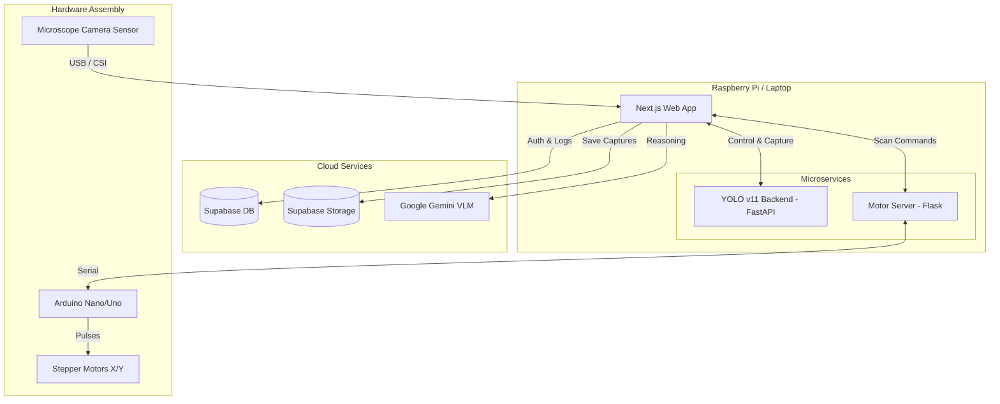
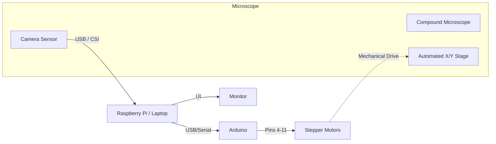
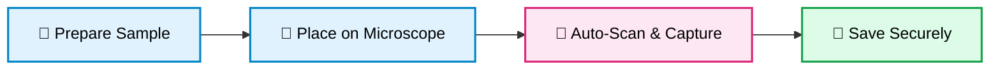

## MicroView AI: Leveraging Large Vision-Language Models in an Augmentative Raspberry Pi–Based System for Urine Microscopy Analysis

This is my undergraduate thesis project for my degree in **Bachelor of Science in Computer Engineering** at **Pamantasan ng Lungsod ng Maynila (PLM)**, where I served as the primary software developer while collaborating with a team. The project aims to develop a cost-effective, Raspberry Pi–based augmentative microscopy urinalysis system enhanced with Vision-Language Models to democratize access to reliable urinalysis diagnostic automation for resource-constrained laboratories.  

---

##  Project Overview

With the recent advancement of foundational models like Gemini, ChatGPT, and other large language models, there has been a paradigm shift in AI capabilities, particularly in multimodal understanding and natural language generation. These Vision-Language Models (VLMs) have demonstrated remarkable potential in analyzing complex visual data while providing human-interpretable explanations. In the context of medical diagnostics, this presents an unprecedented opportunity to explore whether these advanced AI systems can revolutionize automated urinalysis. **MicroView AI** is a cost-effective, Raspberry Pi–based urine microscopy system enhanced with Vision-Language Models (VLMs) that investigates the application of state-of-the-art AI to urine sediment microscopy, exploring their potential to provide accurate, explainable, and cost-effective analysis that could democratize access to reliable diagnostic automation for resource-constrained laboratories. Unlike expensive commercial analyzers, this approach emphasizes both affordability and transparency, addressing the critical gap in diagnostic access by providing a practical, trustworthy tool that bridges the gap between manual and fully automated analysis.

---

### Research Impact
This research contributes to the advancement of accessible medical diagnostics and demonstrates the potential of Visual-Language Models in healthcare technologies. The findings provide a foundation for democratizing reliable urinalysis and addressing the persistent access-accuracy gap in diagnostic services, especially in third world countries where access to such advanced diagnostic machines is limited due to high costs and infrastructure requirements. By combining low-cost hardware with transparent AI, this work positions itself as a viable step toward ensuring diagnostic equity across diverse clinical settings.

## 🏗️ System Architecture

```mermaid
flowchart TB
  subgraph Cloud Services
    DB[(Supabase DB)]
    ST[(Supabase Storage)]
    VLM[Google Gemini VLM]
  end

  subgraph Local Workstation [Raspberry Pi / Laptop]
    UI[Next.js Web App]
    
    subgraph Microservices
      YOLO[YOLO v11 Backend - FastAPI]
      MOTOR[Motor Server - Flask]
    end
    
    UI <-->|Control & Capture| YOLO
    UI <-->|Scan Commands| MOTOR
  end

  subgraph Hardware Assembly
    ARD[Arduino Nano/Uno]
    STEP[Stepper Motors X/Y]
    CAM[Microscope Camera Sensor]
    
    MOTOR <-->|Serial| ARD
    ARD -->|Pulses| STEP
    CAM -->|USB / CSI| UI
  end

  %% Data Flow
  UI -->|Auth & Logs| DB
  UI -->|Save Captures| ST
  UI -->|Reasoning| VLM
```

### Software Stack
- **Frontend**: **Next.js 15** (React 19, TypeScript, Tailwind) - Central orchestrator and UI.
- **AI Backend**: **FastAPI (`mv-backend1-yolo`)** - Runs **YOLO v11** for real-time urine sediment detection.
- **Hardware Backend**: **Flask (`mv-backend2-motor`)** - Manages automated stage movement via serial communication.
- **Database & Storage**: **Supabase** - Handles authentication, patient reports, and image archival.
- **Clinical Insight**: **Google Gemini 2.0** - Large Vision-Language Model for generating detailed urinalysis reports based on scan findings.

---

## 🔌 Hardware Setup Overview

```mermaid
flowchart LR
  subgraph Microscope
    SCOPE[Compound Microscope]
    STAGE[Automated X/Y Stage]
    SENSOR[Camera Sensor]
  end

  SENSOR -->|USB / CSI| RPI[Raspberry Pi / Laptop]

  RPI -->|USB/Serial| ARD[Arduino]
  ARD -->|Pins 4-11| STEP[Stepper Motors]
  STEP -.->|Mechanical Drive| STAGE

  RPI -->|UI| MON[Monitor]
```

### Key Hardware Components
- **Microscope Automation**: Driven by **28BYJ-48 Stepper Motors** with **ULN2003 drivers**, controlled via an Arduino to enable precise serpentine scanning (LPF/HPF).
- **Imaging System**: A high-definition camera sensor mounted on the microscope eyepiece; its feed is ingested by the Raspberry Pi for processing in the Web App.
- **Control Unit**: A **Raspberry Pi** (or Laptop) running the local microservices and the web interface, providing a unified console for the lab technician.
- **Precision Scanning**: Includes a **600ms settle time** after each mechanical move to ensure zero vibration during image capture.

---

## 🧑‍⚕️ For Non-Technical Users: How It Works

### 1. Image Acquisition (Getting the Pictures)

```mermaid
flowchart LR
    A["🧪 Prepare Sample"] --> B["🔬 Place on Microscope"]
    B --> C["🤖 Auto-Scan & Capture"]
    C --> D["💾 Save Securely"]
    
    style A fill:#e0f2fe,stroke:#0284c7,stroke-width:2px,color:#000
    style B fill:#e0f2fe,stroke:#0284c7,stroke-width:2px,color:#000
    style C fill:#fce7f3,stroke:#db2777,stroke-width:2px,color:#000
    style D fill:#dcfce7,stroke:#16a34a,stroke-width:2px,color:#000
```
* **Prepare Sample**: A standard urine sample is placed on a glass slide.
* **Place on Microscope**: The slide is inserted into our automated microscope.
* **Auto-Scan & Capture**: The system automatically moves the slide and takes highly-magnified, clear photos of the sample.
* **Save Securely**: The images are securely saved within the patient's record.

### 2. AI Analysis & Reporting (Understanding the Results)

```mermaid
flowchart LR
    A["📸 Saved Images"] --> B["🧠 AI Detection"]
    B --> C["🤖 Gemini AI Analysis"]
    C --> D["📄 Generate Report"]
    
    style A fill:#dcfce7,stroke:#16a34a,stroke-width:2px,color:#000
    style B fill:#f3e8ff,stroke:#9333ea,stroke-width:2px,color:#000
    style C fill:#fef08a,stroke:#ca8a04,stroke-width:2px,color:#000
    style D fill:#ffedd5,stroke:#ea580c,stroke-width:2px,color:#000
```
* **Saved Images**: The high-resolution images are sent to the AI.
* **AI Detection**: The system identifies specific cells, crystals, and particles in the urine.
* **Gemini AI Analysis**: A medical-grade AI reviews the findings to provide clinical context and explanations.
* **Generate Report**: A simple, readable report is printed or shown to the healthcare professional for final approval.

---

## 📖 User Manual: Step-by-Step Guide

#### Step 1: Login to the System
1. Open the MicroView AI web application on your computer or tablet.
2. Enter your secure lab technician credentials.
> 💡 **Tip:** Ensure your microscope and control box are powered on before logging in!

#### Step 2: Register a Patient & Test
1. Navigate to the **Dashboard**.
2. Click **"+ New Patient"** or select an existing patient.
3. Enter patient details (Name, Age, Gender).
4. A unique `Test Code` will be automatically generated for the session.

#### Step 3: Start Image Acquisition
1. Place the prepared urine sample slide carefully onto the microscope stage.
2. Focus the microscope manually until the view is clear.
3. On the web app, click **"Start Auto-Scan"**.
4. 🛑 **Do not touch the microscope** while the stage is moving. The system will automatically capture multiple images in a grid pattern.

#### Step 4: AI Analysis
1. Once capturing is complete, the images will appear on your screen.
2. Click **"Run AI Analysis"**.
3. The system will detect particles (like Red Blood Cells, White Blood Cells, etc.) automatically.
4. Wait a few moments for the Gemini AI to finalize the interpretations.

#### Step 5: Review and Approve
1. Read through the generated urinalysis report.
2. Verify the AI's findings against the captured images provided on the screen.
3. Click **"Approve & Finalize"** to save the report to the database. You can now print or share the results!

---

*This document serves as the comprehensive academic record of the undergraduate thesis project in Bachelor of Science in Computer Engineering at Pamantasan ng Lungsod ng Maynila, focusing on the development and validation of a cost-effective, Raspberry Pi–based augmentative system enhanced with Vision-Language Models for urinalysis.*
#
