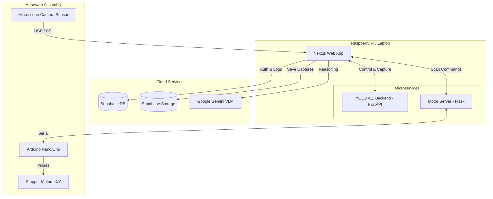
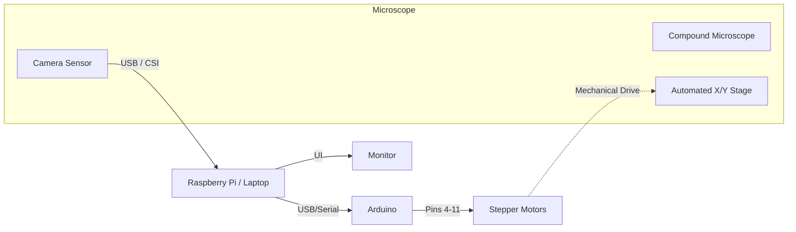
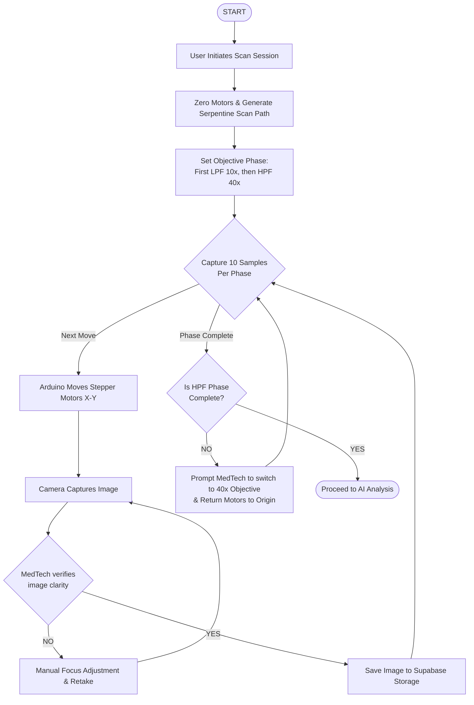
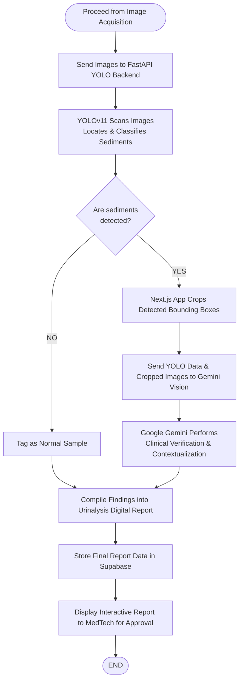

## MicroView AI: Leveraging Large Vision-Language Models in an Augmentative Raspberry Pi–Based System for Urine Microscopy Analysis

This is my undergraduate thesis project for my degree in **Bachelor of Science in Computer Engineering** at **Pamantasan ng Lungsod ng Maynila (PLM)**, where I served as the primary software developer while collaborating with a team. The project aims to develop a cost-effective, Raspberry Pi–based augmentative microscopy urinalysis system enhanced with Vision-Language Models to democratize access to reliable urinalysis diagnostic automation for resource-constrained laboratories.  

---

##  Project Overview

With the recent advancement of foundational models like Gemini, ChatGPT, and other large language models, there has been a paradigm shift in AI capabilities, particularly in multimodal understanding and natural language generation. These Vision-Language Models (VLMs) have demonstrated remarkable potential in analyzing complex visual data while providing human-interpretable explanations. In the context of medical diagnostics, this presents an unprecedented opportunity to explore whether these advanced AI systems can revolutionize automated urinalysis. **MicroView AI** is a cost-effective, Raspberry Pi–based urine microscopy system enhanced with Vision-Language Models (VLMs) that investigates the application of state-of-the-art AI to urine sediment microscopy, exploring their potential to provide accurate, explainable, and cost-effective analysis that could democratize access to reliable diagnostic automation for resource-constrained laboratories. Unlike expensive commercial analyzers, this approach emphasizes both affordability and transparency, addressing the critical gap in diagnostic access by providing a practical, trustworthy tool that bridges the gap between manual and fully automated analysis.

---

### Research Impact
This research contributes to the advancement of accessible medical diagnostics and demonstrates the potential of Visual-Language Models in healthcare technologies. The findings provide a foundation for democratizing reliable urinalysis and addressing the persistent access-accuracy gap in diagnostic services, especially in third world countries where access to such advanced diagnostic machines is limited due to high costs and infrastructure requirements. By combining low-cost hardware with transparent AI, this work positions itself as a viable step toward ensuring diagnostic equity across diverse clinical settings.

## 🏗️ System Architecture

```mermaid
flowchart TB
  subgraph Cloud Services
    DB[(Supabase DB)]
    ST[(Supabase Storage)]
    VLM[Google Gemini VLM]
  end

  subgraph Local Workstation [Raspberry Pi / Laptop]
    UI[Next.js Web App]
    
    subgraph Microservices
      YOLO[YOLO v11 Backend - FastAPI]
      MOTOR[Motor Server - Flask]
    end
    
    UI <-->|Control & Capture| YOLO
    UI <-->|Scan Commands| MOTOR
  end

  subgraph Hardware Assembly
    ARD[Arduino Nano/Uno]
    STEP[Stepper Motors X/Y]
    CAM[Microscope Camera Sensor]
    
    MOTOR <-->|Serial| ARD
    ARD -->|Pulses| STEP
    CAM -->|USB / CSI| UI
  end

  %% Data Flow
  UI -->|Auth & Logs| DB
  UI -->|Save Captures| ST
  UI -->|Reasoning| VLM
```

### Software Stack
- **Frontend**: **Next.js 15** (React 19, TypeScript, Tailwind) - Central orchestrator and UI.
- **AI Backend**: **FastAPI (`mv-backend1-yolo`)** - Runs **YOLO v11** for real-time urine sediment detection.
- **Hardware Backend**: **Flask (`mv-backend2-motor`)** - Manages automated stage movement via serial communication.
- **Database & Storage**: **Supabase** - Handles authentication, patient reports, and image archival.
- **Clinical Insight**: **Google Gemini 2.0** - Large Vision-Language Model for generating detailed urinalysis reports based on scan findings.

---

## 🔌 Hardware Setup Overview

```mermaid
flowchart LR
  subgraph Microscope
    SCOPE[Compound Microscope]
    STAGE[Automated X/Y Stage]
    SENSOR[Camera Sensor]
  end

  SENSOR -->|USB / CSI| RPI[Raspberry Pi / Laptop]

  RPI -->|USB/Serial| ARD[Arduino]
  ARD -->|Pins 4-11| STEP[Stepper Motors]
  STEP -.->|Mechanical Drive| STAGE

  RPI -->|UI| MON[Monitor]
```

### Key Hardware Components
- **Microscope Automation**: Driven by **28BYJ-48 Stepper Motors** with **ULN2003 drivers**, controlled via an Arduino to enable precise serpentine scanning (LPF/HPF).
- **Imaging System**: A high-definition camera sensor mounted on the microscope eyepiece; its feed is ingested by the Raspberry Pi for processing in the Web App.
- **Control Unit**: A **Raspberry Pi** (or Laptop) running the local microservices and the web interface, providing a unified console for the lab technician.
- **Precision Scanning**: Includes a **600ms settle time** after each mechanical move to ensure zero vibration during image capture.

---

## 🧑‍⚕️ For Non-Technical Users: How It Works

### 1. Image Acquisition Process

```mermaid
flowchart TD
    Start([START]) --> UserInit[User Initiates Scan Session]
    UserInit --> MotorZero[Zero Motors & Generate Serpentine Scan Path]
    MotorZero --> PhaseDecision[Set Objective Phase:<br/>First LPF 10x, then HPF 40x]
    
    PhaseDecision --> SampleLoop{Capture 10 Samples<br/>Per Phase}
    
    SampleLoop -->|Next Move| MoveStage[Arduino Moves Stepper Motors X-Y]
    MoveStage --> AutoCapture[Camera Captures Image]
    
    AutoCapture --> IfClear{MedTech verifies<br/>image clarity}
    IfClear -->|NO| Adjust[Manual Focus Adjustment & Retake]
    Adjust --> AutoCapture
    
    IfClear -->|YES| Save[Save Image to Supabase Storage]
    Save --> SampleLoop
    
    SampleLoop -->|Phase Complete| CheckPhase{Is HPF Phase<br/>Complete?}
    CheckPhase -->|NO| SwitchObj[Prompt MedTech to switch to 40x Objective<br/>& Return Motors to Origin]
    SwitchObj --> SampleLoop
    
    CheckPhase -->|YES| Proceed([Proceed to AI Analysis])
```

### 2. AI Analysis & Reporting Process

```mermaid
flowchart TD
    Start([Proceed from Image Acquisition]) --> SendFastAPI[Send Images to FastAPI YOLO Backend]
    SendFastAPI --> YoloDetect[YOLOv11 Scans Images<br/>Locates & Classifies Sediments]
    
    YoloDetect --> AnyDetected{Are sediments<br/>detected?}
    
    AnyDetected -->|NO| TagNormal[Tag as Normal Sample]
    TagNormal --> GenReport
    
    AnyDetected -->|YES| CropImages[Next.js App Crops Detected Bounding Boxes]
    CropImages --> SendGemini[Send YOLO Data & Cropped Images to Gemini Vision]
    SendGemini --> GeminiAnalyse[Google Gemini Performs<br/>Clinical Verification & Contextualization]
    GeminiAnalyse --> GenReport[Compile Findings into Urinalysis Digital Report]
    
    GenReport --> SaveDB[Store Final Report Data in Supabase]
    SaveDB --> Review[Display Interactive Report to MedTech for Approval]
    Review --> End([END])
```

---

## 📖 User Manual: Step-by-Step Guide

### 🛠️ Part 1: Hardware Setup
*A guide to getting the physical microscope and system ready.*

#### Step 1: Powering On
1. **Plug in the Control Box**: Connect the automated motor control box to a power outlet.
2. **Connect to the System**: Plug the USB cable from the control box into your main computer (Raspberry Pi or Laptop).
3. **Turn on the Microscope**: Switch on your compound microscope and adjust the light source until it is bright enough to clearly see a slide.
4. **Attach the Camera**: Carefully insert the digital camera sensor into the microscope's eyepiece tube, then plug its USB cable into your computer.

#### Step 2: Preparing the Stage
1. Ensure the automated microscope stage is clear of any obstacles.
2. Gently place your prepared urine sample slide securely onto the clips of the automated stage.
3. Turn the microscope's objective lens to **10x (Low Power Field - LPF)** to prepare for the first scan.

---

### 💻 Part 2: Software Usage
*A guide to using the MicroView AI application to scan and diagnose.*

#### Step 1: Login & Register Patient
1. Open the **MicroView AI** web application on your computer monitor.
2. Enter your secure lab technician credentials to log in.
3. On the main Dashboard, click **"+ New Patient"**. Enter the patient's Name, Age, and Gender. 
4. A unique tracking `Test Code` will be automatically generated for this session.

#### Step 2: Running the 10x (LPF) Scan
1. Look at your computer screen to view the live camera feed coming from the microscope.
2. Carefully adjust the microscope's focus knob by hand until the image of the urine sample is crisp and clear.
3. Click the **"Start Auto-Scan"** button.
4. 🛑 **Hands Off!** The system will automatically move the slide and take 10 clear pictures. Please do not touch the microscope while the motors are moving.

#### Step 3: Running the 40x (HPF) Scan
1. Once the first scanning phase is done, the system will prompt you on-screen.
2. Manually rotate the microscope lens to the **40x (High Power Field - HPF)** objective. 
3. Re-adjust the fine focus knob until the high-magnification image is perfectly sharp.
4. Click **"Continue"** on the screen. The stage will automatically return to the start and capture 10 highly-magnified pictures.

#### Step 4: AI Analysis & Final Report
1. After all pictures are successfully captured, click **"Run AI Analysis"**.
2. The AI will automatically search for and detect particles like Red Blood Cells, White Blood Cells, and crystals.
3. **Gemini AI** will then compile these findings into a readable clinical report.
4. **Approve & Finalize:** Read through the generated report on your screen. Verify the AI's findings against the captured images, click approve, and print the results for the patient or doctor!

---

*This document serves as the comprehensive academic record of the undergraduate thesis project in Bachelor of Science in Computer Engineering at Pamantasan ng Lungsod ng Maynila, focusing on the development and validation of a cost-effective, Raspberry Pi–based augmentative system enhanced with Vision-Language Models for urinalysis.*
#
